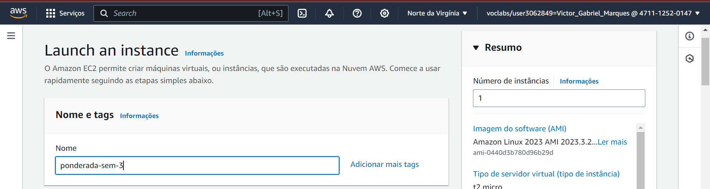
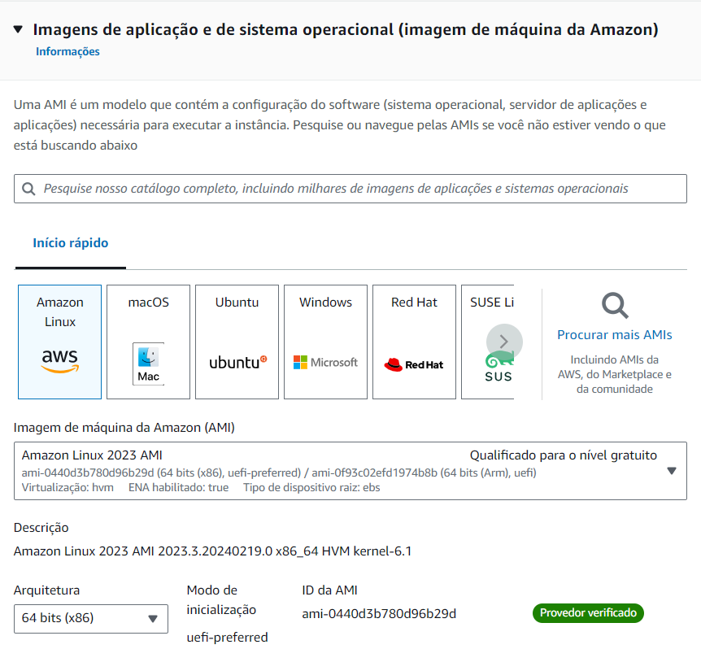
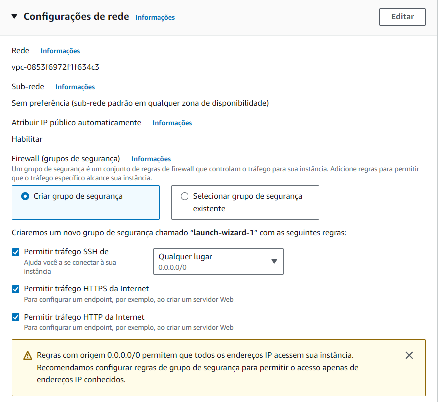
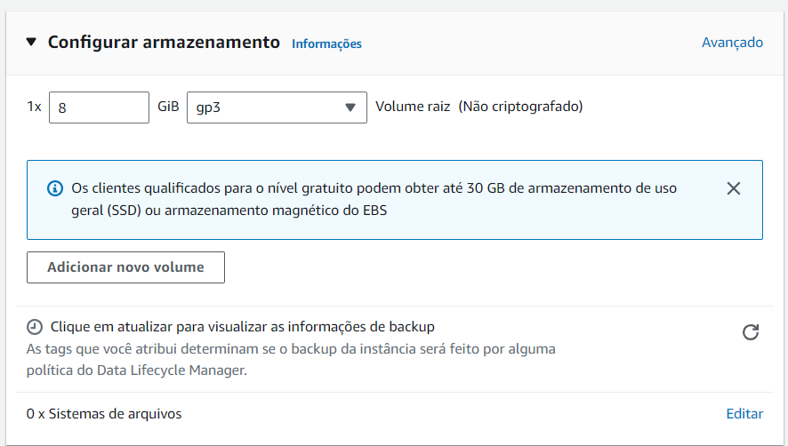

# Introdução 

A priori, o presente relatório almeja delinear meticulosamente o procedimento para a criação e acesso seguro a instâncias de máquinas virtuais EC2 (Elastic Compute Cloud) na plataforma Amazon Web Services (AWS) mediante a empregabilidade do protocolo SSH (Secure Shell), utilizando a notória ferramenta PUTTY. Nesse sentido, a essência deste empreendimento é evidenciar a competência no provisionamento e gestão de recursos computacionais na nuvem de modo inabalavelmente seguro e eficiente.

# Objetivo
* Criar uma instância EC2 na infraestrutura fornecida pela AWS;
* Configurar a instância EC2 de forma básica para atender aos requisitos necessários para esta atividade;
* Estabelecer uma conexão SSH íntegra e segura com a referida instância;
* Documentar de maneira minuciosa todo o processo, englobando capturas de tela pertinentes, a fim de demonstrar proficiência no manejo e orquestração de instâncias na AWS.

# Materiais
* **Conta na Amazon Web Services (AWS)**: Essencial para criação e administração de recursos na plataforma;
* **PUTTY**: Ferramenta de emulação de terminal e cliente SSH, preponderantemente destinada a sistemas Windows e de fácil utilização;
* **Computador com Conectividade à Internet**: Requisito fundamental para acesso ao console da AWS e à aplicação PUTTY.

# Método 
A seguir serão listados os métodos necessários para alcançar os objetivos e gerar resultados que serão listados posteriormente. 

1. Instância EC2:
	* Acesso à Página Inicial do Console da AWS
		
	* Pesquisa pelo serviço de EC2, dentro da Página Inicial de Console da AWS
		
	* Depois de selecionar o serviço EC2, é aberta uma página desse serviço. Ao ser aberta, é possível clicar no botão "Executar instância" para abrir uma outra página para a criação da instância
		
	* Após clicar no botão, é aberta a página "Launch an Instance" é possível criar a Instância EC2, a partir das seguintes definições:
		* Nome: A primeira coisa requerida é nome da instância, algo que facilita a sua identificação futuramente
			
		* AMI: Após isso é necessário escolher uma imagem de máquina da Amazon. A escolhida foi a Amazon Linux AMI, em virtude da sua otimização e desempenho em instâncias EC2, além da preexistência de uma gama de ferramentas e utilitários AWS, fazendo com que o tempo de configuração seja minimizado
			
		* Tipo de Instância: É necessário escolher o tipo da instância que será criada, a fim de definir qual serão suas capacidades internas. Assim, o tipo escolhido foi o padrão, o `t2.micro`, haja vista que possui um equilíbrio entre custo e eficiência, especialmente vantajoso para cenários que não demandam recursos computacionais exacerbados 
			
		* Configurações de Rede: As configurações de rede da instância EC2, que compreende o VPC e sub-rede, foram mantidas as padrões, de modo a simplificar todo o processo de configuração e implantação da instância, embora tenham sido adicionadas regras de segurança para permitir o tráfego HTTP e HTTPS, garantindo um acesso seguro pela internet
			
		* Par de chaves: Foi gerada um novo par de chaves do tipo `.ppk` para a realização de autenticação na instância EC2 criada por meio do SSH, elevando a segurança, pois o acesso à instância é condicionado à posse da chave privada correspondente. Vale ressaltar que o tipo da chave criada é aceita pela ferramenta Putty que será mencionada futuramente. 
			
			
		* Armazenamento: As configurações de armazenamento padrão de 8 GiB com um volume raiz gp3 foram adotadas, uma vez que são padrões e o  cenário em questão não exige especificidades neste âmbito, proporcionando um equilíbrio entre custo e desempenho.
			
	* Concluídos os preenchimentos, procedeu-se à execução da instância mediante a opção "Executar instância".
	
2. Acesso à instância EC2 criada por meio do SSH e Putty:
	* Realizou-se a instalação do software Putty;
	- Na abertura do aplicativo, inseriu-se o endereço IP público da instância no campo "Host name (or IP address)";
			
	- Em seguida, na seção `Auth`, localizada dentro de `SSH`, anexou-se o par de chaves previamente criado no formato `.ppk`;
			
	- Finalmente, a conexão SSH foi estabelecida mediante a seleção da opção "Open".

# Resultados

### Criação da Instância EC2:
Após seguir todos os objetivos e métodos que tangem à criação da EC2, foi possível realizar a sua criação de fato. Sendo assim, a imagem abaixo comprova a sua implantação com sucesso.

### Acesso à Instância EC2 criada via SSH, utilizando Putty:
Seguindo todos os objetivos e métodos que tangem ao acesso à instância EC2 criada por meio do SSH, foi possível realizar tal acesso por meio do Putty. Desse modo, a imagem abaixo comprova tal acesso realizado com sucesso.

### IP Privado da Instância:
* 172.31.83.152

# Conclusão 

A execução exitosa do presente projeto não apenas evidenciou a capacidade de criar e acessar instâncias EC2 na AWS via SSH, mas também ressaltou a importância do domínio dos serviços de computação em nuvem e das práticas de segurança inerentes ao gerenciamento eficiente de recursos na nuvem. A experiência acumulada aqui constitui uma base sólida para empreendimentos futuros envolvendo a infraestrutura AWS.